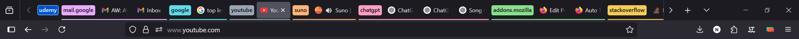
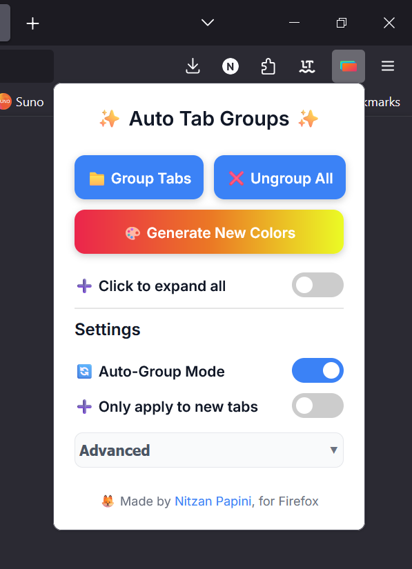

# 🔖 Auto Tab Groups (Firefox Extension)

This is a lightweight Firefox extension that automatically groups open tabs by domain, with intelligent domain name handling for better organization.

📥 **[Install from Firefox Add-ons](https://addons.mozilla.org/en-US/firefox/addon/auto-tab-groups/)**

## Example of tab groups in the navigation bar

[](https://addons.mozilla.org/en-US/firefox/addon/auto-tab-groups/)

## Extension popup interface

[](https://addons.mozilla.org/en-US/firefox/addon/auto-tab-groups/)

---

> ⚠️ Requires **Firefox 138+** for `tabs.group()` support.
> ⚠️ Requires **Firefox 139+** for title and color support.

---

## 🚀 Features

- 🪄 Intelligent tab grouping by domain:
  - Automatically groups tabs by their domain
  - Smart domain name display (e.g., "github" instead of "www.github.com")
  - Special handling for IP addresses, localhost, and .local domains
- 🎨 Advanced color management:
  - Consistent colors for each domain group
  - Random color generation with one click
  - Optional preservation of manually customized colors
  - Remembers color preferences across browser sessions
- 📎 Group management:
  - One-click collapse/expand all groups
  - Real-time group updates
  - Maintains existing groups without duplicates
- ⚙️ Configuration options:
  - Toggle auto-grouping (on/off)
  - Toggle only applying to new tabs (on/off)
  - Toggle grouping by subdomain (on/off)
  - Toggle preservation of manual color choices (on/off)

## Planned Features

- Group tabs by custom rules (e.g., keyword, container, time opened)
- Save/Load window state, including tab groups, pinned tabs, and window position
- AI-powered tab grouping (In Progress):
  - Server-side AI grouping API with token-based usage tracking
  - Free tier with limited trial tokens and premium tier with unlimited usage
  - Smart grouping based on tab content, not just domain names
  - Secure data handling with proper authentication and encryption

The AI grouping feature is currently under active development with:

- API contract defined for client-server communication
- Server infrastructure being built with Go
- Planned integration with AI providers for intelligent grouping
- Premium model designed with free trial tokens and unlimited premium usage

**Since this is open source, to run the AI grouping feature locally, users will need to provide their own API key.**

---

## 📦 Project Structure

- `background.js`: Main background script for managing tab groups
- `services/`:
  - `TabGroupService.js`: Core tab grouping logic and color management
  - `DomainUtils.js`: Domain name processing and formatting utilities
- `state/`:
  - `TabGroupState.js`: State management for settings and color preferences
- `manifest.json`: Extension manifest file
- `popup/`: UI components for extension controls
- `server/`: Backend for AI-powered tab grouping (in development)
  - `cmd/api/`: Server entry point and configuration
  - `internal/`: Core server components
    - `database/`: Database access layer
    - `server/`: HTTP server and route handlers
- `docs/`: Documentation for AI features and implementation plans

---

## 🛠 Development Setup

### Extension

1. Install dependencies:

```bash
npm install
```

2. Available scripts:

- `npm start`: Run the extension in Firefox for development
- `npm run build`: Build the extension and generate .xpi file
- `npm run format`: Format code using Prettier
- `npm run lint`: Run ESLint checks

### Server (TBD, for AI features)

1. Set up Go development environment
2. Navigate to the server directory:

    ```bash
    cd server
    ```

3. Build and run the server:

    ```bash
    make run
    ```

4. For development with hot reload:

    ```bash
    make dev
    ```

### Loading Extension for Development

1. Open Firefox and go to: `about:debugging`
2. Click **"This Firefox"** → **"Load Temporary Add-on..."**
3. Select the `manifest.json` file from the `src` directory

---

## 🧪 Usage

The extension works automatically in the background, grouping tabs by domain with intelligent name formatting. Click the extension icon in the browser toolbar to:

- Toggle automatic grouping
- Configure grouping options
- Manually trigger grouping for all tabs
- Generate new random colors for groups
- Collapse or expand all groups at once
- Access advanced settings:
  - Group by subdomain
  - Preserve manual color choices

### Color Management

The extension provides several ways to manage tab group colors:

1. **Automatic Colors**: Each domain gets a consistent color by default
2. **Manual Customization**:
   - Right-click any tab group to change its color
   - The extension can remember your custom color choices
3. **Random Generation**:
   - Click "Generate New Colors" to randomly assign new colors
   - Use the "Preserve manual colors" setting to keep your custom choices when generating new colors

### Group Management

The extension provides convenient ways to manage your tab groups:

1. **Automatic Grouping**:
   - Tabs are automatically grouped by domain
   - New tabs are added to existing groups
2. **Manual Controls**:
   - Group/Ungroup all tabs with one click
   - Collapse or expand all groups simultaneously
   - Right-click groups for individual controls

---

## 🧠 How It Works

### Tab Grouping Logic

- Uses the [`browser.tabs.group()`](https://developer.mozilla.org/en-US/docs/Mozilla/Add-ons/WebExtensions/API/tabs/group) API
- Groups tabs based on their root domain
- Maintains group consistency during tab operations (refresh, new tab, etc.)
- Intelligently formats domain names for group titles:
  - Removes TLD (e.g., ".com", ".org")
  - Removes "www" subdomain when present
  - Special handling for IP addresses and local domains

### Group State Management

- Tracks collapse state of all groups
- Provides unified controls for group visibility
- Maintains group state during tab operations
- Ensures smooth transitions when collapsing/expanding

## 📚 Resources

- [MDN WebExtensions API Docs](https://developer.mozilla.org/en-US/docs/Mozilla/Add-ons/WebExtensions)
- [tabs.group() API](https://developer.mozilla.org/en-US/docs/Mozilla/Add-ons/WebExtensions/API/tabs/group)

---

## 📦 Distribution

### Building for Production

1. Update version in `manifest.json`
2. Build the extension:

    ```bash
    npm run build
    ```

3. The built extension will be available as an .xpi file

### Publishing to Firefox Add-ons

1. Update the version in `manifest.json`
2. Build using `npm run build`
3. Upload the .xpi file to [Firefox Add-ons Developer Hub](https://addons.mozilla.org/en-US/developers/)

## 👨‍💻 Author

Built by [Nitzan Papini](https://github.com/nitzanpap)

## 📄 License

See [LICENSE.md](LICENSE.md) for details.
