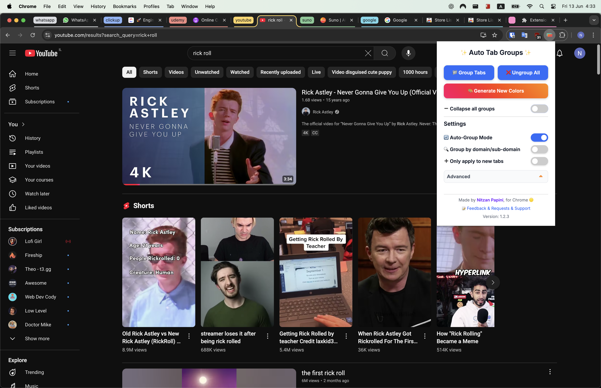
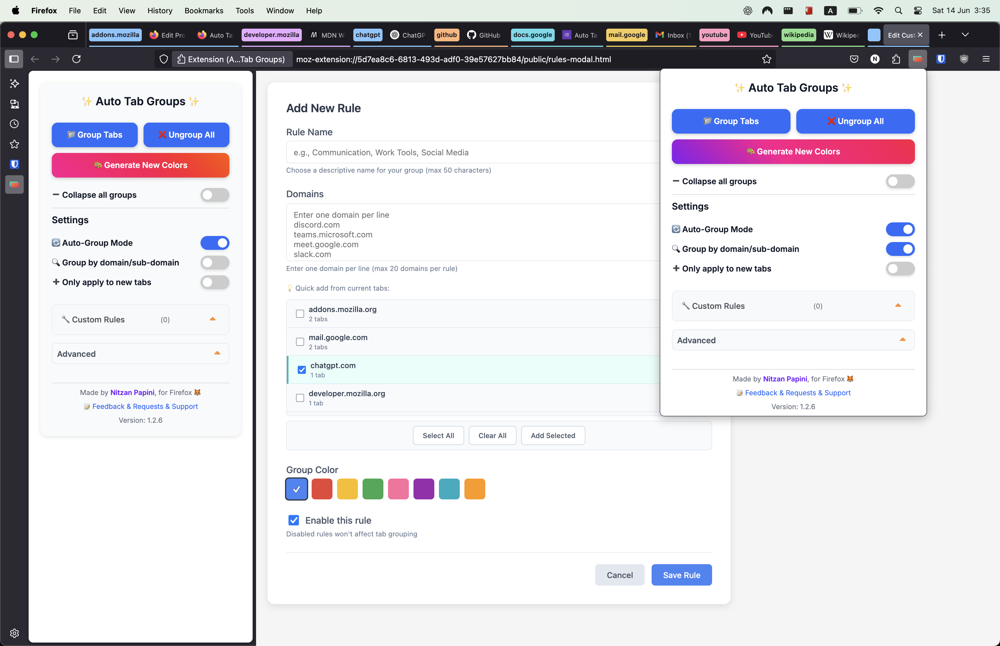

# 🔖 Auto Tab Groups (Cross-Browser Extension)

A lightweight cross-browser extension that automatically groups open tabs by domain, with intelligent domain name handling for better organization. Works on both Chrome and Firefox!

## 📦 Downloads

🦊 **[Firefox Add-ons](https://addons.mozilla.org/en-US/firefox/addon/auto-tab-groups/)**
🌐 **[Chrome Web Store](https://chromewebstore.google.com/detail/auto-tab-groups/cmolegdbajakaekbamkdhonkaldgield)**

## Example of tab groups in the navigation bar

[](https://chromewebstore.google.com/detail/auto-tab-groups/cmolegdbajakaekbamkdhonkaldgield)

[](https://addons.mozilla.org/en-US/firefox/addon/auto-tab-groups/)

---

## 🌐 Browser Compatibility

| Browser | Version | Status                                           |
| ------- | ------- | ------------------------------------------------ |
| Firefox | 139+    | ✅ Fully supported (Manifest V3, Tab Groups API) |
| Chrome  | Latest  | ✅ Fully supported (Manifest V3, Tab Groups API) |

**Note**: Firefox 139+ required for full Tab Groups API support and enhanced features.

---

## 🚀 Features

- ✅ **Cross-browser compatibility** - Single codebase for Chrome and Firefox
- ✅ **Domain-based tab grouping** - Automatically groups tabs by website domain
- ✅ **Custom rules** - Create named groups that combine multiple domains
- ✅ **Rules export/import** - Backup, share, and migrate custom rules as JSON files
- ✅ **Smart domain display** - Shows clean domain names (e.g., "github" instead of "github.com")
- ✅ **Color management** - Persistent group colors across browser sessions
- ✅ **Collapse/expand controls** - Manage tab group visibility
- ✅ **Configuration options** - Auto-grouping, subdomain handling, etc.
- ✅ **Side panel support** - Chrome side panel and Firefox sidebar
- ✅ **Modern UI** - Clean, responsive interface

### 🪄 Intelligent Tab Grouping

- Automatically groups tabs by their domain/subdomain
- Smart domain name display (e.g., "github" instead of "www.github.com")
- **Country code second-level domain (ccSLD) support** - Properly handles domains like `calendar-uk.co.uk`, `example.co.uk`, `abc.net.au`, etc.
- Special handling for IP addresses, localhost, and .local domains
- Real-time group updates as you browse

### 🛠️ Custom Rules System

- **Priority System**: Custom rules take priority over domain-based grouping
- **Fallback**: Domains not covered by custom rules still use automatic domain grouping
- **Real-time**: Changes to rules immediately re-group existing tabs
- **Quick add from current tabs**: Select domains from your currently open tabs instead of typing them manually
- **Example Use Cases**:
  - **Communication**: Group `discord.com`, `teams.microsoft.com`, `slack.com` under "Communication"
  - **Development**: Group `github.com`, `stackoverflow.com`, `docs.google.com` under "Dev Tools"
  - **Social Media**: Group `twitter.com`, `facebook.com`, `instagram.com` under "Social"

### 📎 Group Management

- One-click collapse/expand all groups
- Real-time group updates
- Maintains existing groups without duplicates
- Group/Ungroup all tabs with one click

### 🎨 Advanced Color Management

- Consistent colors for each domain group
- Random color generation with one click
- Optional preservation of manually customized colors
- Remembers color preferences across browser sessions

### ⚙️ Configuration Options

- Toggle auto-grouping (on/off)
- Toggle grouping by subdomain (on/off)
- Toggle only applying to new tabs (on/off)
- Toggle preservation of manual color choices (on/off)

### 📱 Side Panel & Sidebar Support

- Chrome side panel and Firefox sidebar integration
- Displays tab groups for easy access
- Allows quick navigation between groups
- Sidebar popup as an alternative to the main popup

## Planned Features

- **AI-powered tab grouping (In Progress)**:
  - Utilizing [WebLLM](https://github.com/mlc-ai/web-llm/tree/main/examples/chrome-extension) for intelligent tab grouping in the client's browser (Awesome for privacy)
  - Smart grouping based on tab content, not just domain names
  - Manually invoking AI for creating rules and grouping tabs based on them.
  - Letting the AI to autonomously decide to group tabs, and creating rules.
- **Custom Rules UI Enhancements**:
  - Improved user interface for managing custom rules
  - Better visualization of rule priorities and conflicts
- **Search Functionality**:
  - Search through open tabs and groups
  - Filter by domain, group name, or custom rules
- **Improve Security, XSS, and CSP**:
  - Enhanced security measures to prevent XSS attacks
  - Content Security Policy (CSP) updates for better protection

The AI grouping feature is currently under active development with:

- A form of web-native LLM.

**Since this is open source, to run the AI grouping feature locally, users will need to provide their own API key.**

---

## 🛠️ Development

The extension is built with [WXT](https://wxt.dev/) and TypeScript, supporting both Chrome and Firefox from a unified codebase.

### Quick Start

```bash
bun install
bun run dev        # Start development server
```

### Build Commands

| Command                 | Description                          |
| ----------------------- | ------------------------------------ |
| `bun run dev`           | Start WXT development server         |
| `bun run dev:chrome`    | Development server for Chrome        |
| `bun run dev:firefox`   | Development server for Firefox       |
| `bun run build`         | Build production extension (Chrome)  |
| `bun run build:firefox` | Build production extension (Firefox) |
| `bun run zip`           | Create release zip (Chrome)          |
| `bun run zip:firefox`   | Create release zip (Firefox)         |
| `bun run typecheck`     | Run TypeScript type checking         |
| `bun run test`          | Run unit tests (272+ tests)          |
| `bun run lint`          | Run Biome linter                     |
| `bun run format`        | Format with Biome                    |

### Loading for Development

**Chrome:**

1. Run `bun run dev:chrome`
2. Go to `chrome://extensions/`
3. Enable "Developer mode"
4. Click "Load unpacked"
5. Select `.output/chrome-mv3-dev/`

**Firefox:**

1. Run `bun run dev:firefox`
2. Go to `about:debugging#/runtime/this-firefox`
3. Click "Load Temporary Add-on"
4. Select any file in `.output/firefox-mv3-dev/`

---

## 🧪 Testing

The project follows Test-Driven Development (TDD) principles with comprehensive test coverage across unit and end-to-end tests.

### Test Stack

| Tool       | Purpose                        |
| ---------- | ------------------------------ |
| Vitest     | Unit tests (fast, Vite-native) |
| Playwright | E2E browser extension testing  |

### Running Tests

```bash
bun run test          # Run unit tests (272+ tests)
bun run test:e2e      # Build extension and run E2E tests
```

### Unit Tests

Located in `tests/`, these test core utilities and business logic:

- **`DomainUtils.test.ts`** (45 tests) - Domain extraction, ccSLD handling, edge cases
- **`UrlPatternMatcher.test.ts`** (27 tests) - URL pattern matching, wildcards, validation

```bash
bun run test                    # Run all unit tests
bun run test -- --watch         # Watch mode during development
bun run test -- --coverage      # Generate coverage report
```

### E2E Tests

Located in `tests/e2e/`, these test the extension in a real browser:

- **`extension.spec.ts`** - Extension loading, popup UI, toggle functionality, sidebar

E2E tests require building the extension first:

```bash
bun run test:e2e            # Builds Chrome extension, then runs Playwright
```

**Note:** E2E tests run in headed mode (visible browser) since Chrome extension testing requires it.

### Test Coverage Goals

- **Unit tests**: Core utilities at 80%+ coverage
- **E2E tests**: Critical user flows (popup, toggle, rules)

### Writing New Tests

Follow TDD workflow:

1. **Write test first** (RED) - Define expected behavior
2. **Run test** - Verify it fails
3. **Implement code** (GREEN) - Minimal code to pass
4. **Refactor** (IMPROVE) - Clean up while keeping tests green

Example unit test pattern:

```typescript
import { describe, it, expect } from "vitest"
import { extractDomain } from "../utils/DomainUtils"

describe("extractDomain", () => {
  it("extracts domain from standard URL", () => {
    expect(extractDomain("https://github.com/user/repo")).toBe("github")
  })

  it("handles ccSLD domains correctly", () => {
    expect(extractDomain("https://example.co.uk/page")).toBe("example")
  })
})
```

---

## 📦 Project Structure

```text
auto-tab-groups/
├── entrypoints/              # Extension entry points (WXT)
│   ├── background.ts         # Service worker
│   ├── popup/                # Popup UI
│   │   ├── index.html
│   │   ├── main.ts
│   │   └── style.css
│   ├── sidebar/              # Sidebar UI (Chrome side panel / Firefox sidebar)
│   │   ├── index.html
│   │   └── main.ts
│   └── rules-modal.unlisted/ # Rule creation/editing modal
│       ├── index.html
│       ├── main.ts
│       └── style.css
├── services/                 # Business logic
│   ├── TabGroupService.ts    # Tab grouping logic
│   ├── RulesService.ts       # Custom rules management
│   ├── TabGroupState.ts      # State management
│   └── index.ts
├── utils/                    # Utilities
│   ├── DomainUtils.ts        # Domain processing with ccSLD support
│   ├── UrlPatternMatcher.ts  # URL pattern matching
│   ├── Constants.ts          # Tab group colors
│   ├── RulesUtils.ts         # Rule validation helpers
│   └── storage.ts            # WXT storage utilities
├── types/                    # TypeScript type definitions
├── tests/                    # Unit tests (272+ tests)
├── public/                   # Static assets (icons)
├── docs/                     # Documentation
├── wxt.config.ts             # WXT configuration
├── vitest.config.ts          # Vitest configuration
├── tsconfig.json             # TypeScript configuration
└── package.json
```

---

## 🧪 Usage

The extension works automatically in the background, grouping tabs by domain with intelligent name formatting. Click the extension icon in the browser toolbar to:

- Toggle automatic grouping
- Configure grouping options
- Manually trigger grouping for all tabs
- Generate new random colors for groups
- Collapse or expand all groups at once
- Access advanced settings:
  - Group by subdomain
  - Preserve manual color choices
- Create and manage custom rules for advanced grouping

### Custom Rules

Create named tab groups that combine multiple domains under a single group:

1. Open the extension popup
2. Click "Custom Rules" to expand the section
3. Click "Add New Rule" to create your first rule
4. Enter a group name (or let the system suggest one)
5. **Quick add from current tabs**: Select domains from your currently open tabs instead of typing them manually
6. Choose a color and save

**Example Use Cases**:

- **Communication**: Group `discord.com`, `teams.microsoft.com`, `slack.com` under "Communication"
- **Development**: Group `github.com`, `stackoverflow.com`, `docs.google.com` under "Dev Tools"
- **Social Media**: Group `twitter.com`, `facebook.com`, `instagram.com` under "Social"

### Color Management

The extension provides several ways to manage tab group colors:

1. **Automatic Colors**: Each domain gets a consistent color by default
2. **Manual Customization**:
   - Right-click any tab group to change its color
   - The extension can remember your custom color choices
3. **Random Generation**:
   - Click "Generate New Colors" to randomly assign new colors
   - Use the "Preserve manual colors" setting to keep your custom choices when generating new colors

### Group Management

The extension provides convenient ways to manage your tab groups:

1. **Automatic Grouping**:
   - Tabs are automatically grouped by domain
   - New tabs are added to existing groups
2. **Manual Controls**:
   - Group/Ungroup all tabs with one click
   - Collapse or expand all groups simultaneously
   - Right-click groups for individual controls

---

## 🧠 How It Works

### Tab Grouping Logic

- Uses the [`browser.tabs.group()`](https://developer.mozilla.org/en-US/docs/Mozilla/Add-ons/WebExtensions/API/tabs/group) API
- Groups tabs based on their root domain
- Maintains group consistency during tab operations (refresh, new tab, etc.)
- **Smart domain extraction** with support for country code second-level domains (ccSLDs):
  - `abc.net.au` → Groups as "abc" (recognizes `co.au` as single TLD)
  - `shop.example.co.uk` → Groups as "example" (recognizes `co.uk` as single TLD)
  - `www.github.com` → Groups as "github" (standard domain handling)
- Intelligently formats domain names for group titles:
  - Removes TLD properly (e.g., ".com", ".org", ".co.uk")
  - Removes "www" subdomain when present
  - Special handling for IP addresses and local domains

### Group State Management

- Tracks collapse state of all groups
- Provides unified controls for group visibility
- Maintains group state during tab operations
- Ensures smooth transitions when collapsing/expanding

### 🌍 Country Code Second-Level Domain (ccSLD) Support

The extension includes intelligent handling for country-specific domains that use two-part top-level domains:

**Supported ccSLDs include:**

- **United Kingdom**: `.co.uk`, `.org.uk`, `.net.uk`, `.ac.uk`, `.gov.uk`
- **Australia**: `.com.au`, `.net.au`, `.org.au`, `.edu.au`, `.gov.au`
- **New Zealand**: `.co.nz`, `.net.nz`, `.org.nz`, `.ac.nz`, `.govt.nz`
- **South Africa**: `.co.za`, `.org.za`, `.net.za`, `.ac.za`, `.gov.za`
- **Japan**: `.co.jp`, `.or.jp`, `.ne.jp`, `.ac.jp`, `.go.jp`
- **South Korea**: `.co.kr`, `.or.kr`, `.ne.kr`, `.ac.kr`, `.go.kr`
- And many more...

**Examples:**

- `abc.net.au` → Groups as "abc" (not "co")
- `shop.example.co.uk` → Groups as "example" (not "co")
- `api.service.com.au` → Groups as "service" (not "com")

This ensures that international users get proper domain grouping regardless of their country's domain structure.

## 📚 Resources

- [MDN WebExtensions API Docs](https://developer.mozilla.org/en-US/docs/Mozilla/Add-ons/WebExtensions)
- [tabs.group() API](https://developer.mozilla.org/en-US/docs/Mozilla/Add-ons/WebExtensions/API/tabs/group)
- [WXT Framework](https://wxt.dev/)

---

## 📦 Distribution

### Building for Production

1. Update version in `package.json`
2. Build the extension:

   ```bash
   bun run zip          # Chrome
   bun run zip:firefox  # Firefox
   ```

3. Output files:
   - `.output/auto-tab-groups-{version}-chrome.zip`
   - `.output/auto-tab-groups-{version}-firefox.zip`

### Publishing

**Chrome Web Store:**

1. Go to [Chrome Web Store Developer Dashboard](https://chrome.google.com/webstore/devconsole)
2. Upload the Chrome zip file

**Firefox Add-ons:**

1. Go to [Firefox Add-on Developer Hub](https://addons.mozilla.org/developers/)
2. Upload the Firefox zip file

---

## 👨‍💻 Author

Built by [Nitzan Papini](https://github.com/nitzanpap)

## 📄 License

See [LICENSE.md](LICENSE.md) for details.
