# Auto Tab Groups System Architecture (v3.15.5)

## 1. Architectural Foundation & Core Principles

Auto Tab Groups is a cross-browser extension engineered around the core principle of **Browser as Single Source of Truth (SSOT)**.
In browser extensions running on Manifest V3 (MV3), service workers are ephemeral and can be terminated by the browser at any time during idle states. Consequently, all critical state management conforms to these architectural axioms:

- **Stateless Domain Mappings**: The background service worker queries the browser's live tab and group APIs rather than maintaining unverified in-memory domain-to-group mappings.
- **Title as Group Identity**: Group identity is matched by exact title (or normalized title after stripping sort index prefixes).
- **No Empty Groups**: In accordance with browser tab group constraints, groups are created dynamically by moving tabs into them, and are automatically dismantled when their last member tab exits.
- **Resilient Mutation Execution**: All browser tab editing operations (`tabs.move`, `tabs.group`, `tabs.ungroup`, `tabGroups.update`) are executed through exponential backoff retry wrappers (`withTabEditRetry`) to mitigate transient `Tabs cannot be edited right now` locking errors.

---

## 2. System Topology & Directory Clusters

Extracted via **Graft AST Intelligence** (663 Nodes, 1,631 Edges across TypeScript AST):

```mermaid
graph TD
    subgraph Entrypoints ["Entrypoints & UI Interfaces"]
        BG["background.ts (Service Worker)"]
        Popup["popup/ (Action Interface)"]
        Sidebar["sidebar/ (Side Panel Interface)"]
        Modal["rules-modal/ (Rule Editor)"]
        Graph3D["graph-3d/ (3D Force Graph Visualizer)"]
    end

    subgraph CoreServices ["Core Services Layer"]
        TGS["TabGroupService (Group Coordinator)"]
        State["TabGroupState (Storage & Config Mirror)"]
        Rules["RulesService (Rule Evaluator & Matcher)"]
        Sort["TabSortService (Group Sorter)"]
        Compare["TabComparisonService (Interactive Pairer)"]
        FirstRun["FirstRunService (Seed & Migration)"]
    end

    subgraph AiSubsystem ["AI & Intelligence Engine"]
        Ai["AiService (AI Orchestrator)"]
        WebLLM["WebLlmProvider (Local WebGPU / In-Browser)"]
        ExtAI["ExternalAiProvider (OpenAI-compatible / Ollama)"]
        Semantic["SemanticGrouping (Vector/Cosine Clustering)"]
        Detector["EntityServiceDetector (Entity/Brand Recognition)"]
        Parser["AiResponseParser (Fault-Tolerant JSON Extractor)"]
    end

    subgraph StorageUtils ["Storage & Utilities"]
        Storage["storage.ts (wxt/storage schema definitions)"]
        Matcher["UrlPatternMatcher (Glob / Regex Engine)"]
        Retry["withTabEditRetry (Exponential Backoff)"]
    end

    BG --> TGS
    BG --> Ai
    BG --> Compare
    BG --> Storage
    TGS --> State
    TGS --> Rules
    TGS --> Detector
    TGS --> Retry
    TGS --> Compare
    Ai --> WebLLM
    Ai --> ExtAI
    Ai --> Parser
    BG --> Semantic
    Popup --> BG
    Sidebar --> BG
    Graph3D --> BG
```

---

## 3. Subsystem Breakdown

### 3.1 Tab Group Management Service (`services/TabGroupService.ts`)
- **Single Responsibility**: Coordinates tab movements, group creations, domain evaluations, and auto-grouping lifecycle hooks.
- **Key Behaviors**:
  - `handleTabUpdate(tabId)`: Evaluates tab destination against custom rules, domain mappings, or system URL policies.
  - `moveTabToTargetGroup(...)`: Resolves group existence, handles tab grouping, sets assigned group color, and consolidates co-domain ungrouped tabs.
  - `restoreSavedColors()`: Restores persisted user group colors across browser restarts.
  - `enforceLaterGroupLeaderTab(groupId)`: Enforces pinning/leader retention for the Read Later ("فيما بعد") tab group.
  - `ungroupAllTabs(forceAll)`: Safely dissolves groups while preserving user-protected groups unless explicit force flag is asserted.

### 3.2 Tab Comparison Service (`services/TabComparisonService.ts`)
- **Single Responsibility**: Interactive A/B workflow pairing two tabs into a unified comparison group.
- **State Machine Flow**:
  1. Trigger comparison from popup/sidebar or command -> state marked `active`, source tab ID captured.
  2. Browser badge updated to `CMP` via `browser.action.setBadgeText`.
  3. User switches to or focuses second tab -> `handleTabActivated(targetTabId, windowId)`.
  4. Automatically groups both tabs into `"Comparison"` group with color `purple`.
  5. Badge cleared and comparison session completed.
  6. Cancellation restores both tabs back to their respective parent group IDs.

### 3.3 AI & Semantic Grouping Subsystem (`services/ai/`)
- **`AiService.ts`**: Central orchestrator managing provider dispatch, similarity threshold settings, custom models registry, and model loading lifecycle.
- **Provider Multi-Tenancy**:
  - `WebLlmProvider.ts`: Client-side on-device inference via WebGPU using `@mlc-ai/web-llm` (e.g. Qwen2.5 3B, Llama 3.2 3B). Zero bundle cost until dynamically imported.
  - `ExternalAiProvider.ts`: Local and remote OpenAI-compatible API bridge (Ollama at `http://localhost:11434/v1`, LM Studio, vLLM, OpenAI, Groq).
- **`utils/SemanticGrouping.ts`**: Algorithmic clustering based on tokenized term vectors and cosine similarity for tabs sharing conceptual themes without explicit rules.
- **`utils/EntityServiceDetector.ts`**: Fast pattern matching against common platforms (Google Services, AWS, GitHub, Microsoft) to assign brand colors and titles automatically.

### 3.4 3D Tab Visualization Subsystem (`entrypoints/graph-3d.unlisted/`)
- Visualizes open tabs and their relationships in an interactive 3D force-directed graph built with `3d-force-graph`, `d3-force-3d`, and `three`.
- **Graph Topology**:
  - Window & Group Hub Nodes: Connected by group affiliation.
  - Tab Leaf Nodes: Embedded with domain favicons, title tooltips, and real-time active status rings.
  - Direct Tab Activation: Clicking a 3D node sends `activateTab` message to focus the physical browser tab and window.

### 3.5 Side Panel & Chrome Action Routing (`entrypoints/background.ts`)
- Configures Chrome Side Panel API (`chrome.sidePanel.setPanelBehavior({ openPanelOnActionClick: true })`) in MV3.
- Bridges popup actions, sidebar views, and command shortcuts into a single consolidated message router.

---

## 4. Architectural Invariants & Safety Guardrails

| Invariant ID | Rule Statement | Enforcement Location | Rationale |
| :--- | :--- | :--- | :--- |
| **INV-01** | Pinned tabs are never moved into any group | `TabGroupService.handleTabUpdate` | Preserves user tab bar anchor layout |
| **INV-02** | System groups are never placed on protected list | `background.ts:ensureStateLoaded` | Prevents extension lockouts and orphaned system tabs |
| **INV-03** | Browser mutations must use retry backoff | `utils/withTabEditRetry.ts` | Eliminates browser tab transition drag collisions |
| **INV-04** | Comparison group is protected during active session | `TabGroupService.isInProtectedGroup` | Avoids auto-grouping tearing apart comparison pairs |
| **INV-05** | External AI requests require strict parameter validation | `AiService.testConnection` / `ExternalAiProvider` | Guards against malformed URLs and credential leaks |
